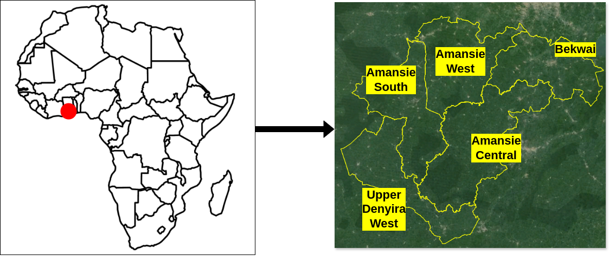
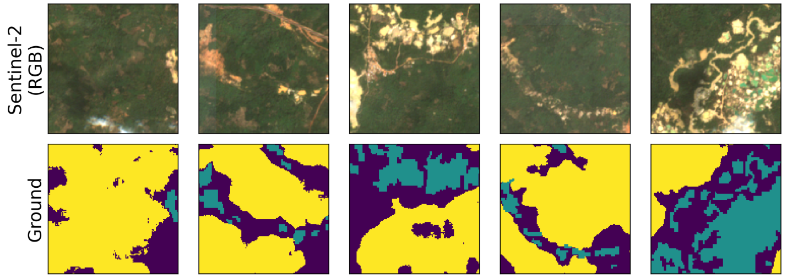

<div align="center">

<h3>Cocoa under Threat: Assessing the Impact of Artisanal Gold Mining on Cocoa Landscapes using Remote Sensing and Foundation Model</h3>

[Stella Ofori-Ampofo]<sup>1</sup>, [Antony Zappacosta]<sup>2</sup>, [Ridvan Salih Kuzu]<sup>2</sup>, [Peter Schauer]<sup>3</sup>, [Martin Willberg]<sup>3</sup>, [Xiao Xiang Zhu]<sup>1,4</sup>, 

<sup>1</sup> Technical University of Munich, <sup>2</sup> German Aerospace Center (DLR), <sup>3</sup> Industrieanlagen-Betriebsgesellschaft mbH (IABG), <sup>4</sup> Munich Center for Machine Learning

Paper: [Journal](https://github.com/ellaampy/ml_cocoa_mining/edit/main/README.md) (DOI: 00.000/000000)
</div>


### Introduction
Agriculture remains a cornerstone of Ghana's economy. More than half of the land area is dedicated to agriculture, and its expansion continues to accelerate. Despite this growth, the sector faces compounding challenges, including climate-induced risks such as prolonged droughts, which aggravate low yields and threaten long-term productivity. A dimension of Ghana's agricultural landscape is agro-ecological regions, which not only sustain primary agricultural activities such as cocoa production but also coincidentally overlap with areas rich in mineral resources where several extractive sector activities, such as gold mining, occur on small and large scales. This convergence has driven a transition from agriculture landuse to mining, reshaping economic priorities and landuse dynamics. Artisanal and small-scale gold mining (ASGM) is on the rise, expanding into cocoa-dominated landscapes and posing serious threats to agricultural soils, water resources, and cropland due to its unregulated and unsustainable nature. Leveraging satellite imagery and geospatial analysis, we mapped cocoa and mining landuse, revealed areas where ASGM has taken over cocoa farmland, assessed the economic value of the transitioned areas, analyzed atmospheric elemental mercury in the cocoa landscape and developed a cocoa risk map. 

### Study area



### Data 
- Our work relies on satellite imagery from [SmallMinesDS](https://huggingface.co/datasets/ellaampy/SmallMinesDS) which contains ```4270``` patches; ```2175``` each for 2016 and 2022
  
- SmallMinesDS contains 13 channels. Only 6 bands (B-G-R-NIR-SWIR1-SWIR2) were used for this 3-class (background-1, mining-2, cocoa-3) segmentation problem
  
- Hence each patch has an input shape of ```6 x 128 x 128``` and a corresponding mask of ```1 x 128 x 128```

- The 3-class labels can be downloaded from [HuggingFace](https://huggingface.co/datasets/ellaampy/SmallMinesDS) and matched to satellite data from SmallMinesDS




### Quick start

#### Prerequisites
- **Conda** (for managing environments)
- **NVIDIA GPU** (for efficient computation)

#### Setting Up Environments
A virtual environment is required:
**Terratorch Environment** (for TerraTorch dependencies)

#### Creating the TerraTorch Environment
```bash
conda create -n terratorch python=3.11
conda activate terratorch
pip install -r requirements.txt
conda deactivate
```

#### Fine-tuning Prithvi-2
Fine-tune Prithvi-2 using our dataset.

##### Fine-tuning with the 300M Model
```bash
conda activate terratorch
python scripts/train-prithvi-v2-300.py
```

#### Training ResNet50 from Scratch
To compare with Prithvi-2, we train ResNet50 from scratch.

```bash
conda activate terratorch
python scripts/train-resnet50-6bands.py
```

### Citation
If you use the dataset or supporting code in your research, please cite `SmallMinesDS` and "Cocoa under Threat" as :

```
@ARTICaLE{10982207,
  author={Ofori-Ampofo, Stella and Zappacosta, Antony and Kuzu, Rıdvan Salih and Schauer, Peter and Willberg, Martin and Zhu, Xiao Xiang},
  journal={IEEE Geoscience and Remote Sensing Letters}, 
  title={SmallMinesDS: A Multi-Modal Dataset for Mapping Artisanal and Small-Scale Gold Mines}, 
  year={2025},
  volume={},
  number={},
  pages={1-1},
  keywords={Data mining;Foundation models;Gold;Satellite images;Sentinel-1;Optical sensors;Laser radar;Biological system modeling;Spaceborne radar;Radar imaging;Earth Observation;Semantic Segmentation;Mining;Machine Learning;Foundation Models},
  doi={10.1109/LGRS.2025.3566356}}

@ARTICaLE{id,
  author={Ofori-Ampofo, Stella and Zappacosta, Antony and Kuzu, Rıdvan Salih and Schauer, Peter and Willberg, Martin and Zhu, Xiao Xiang},
  journal={}, 
  title={Cocoa under Threat: Assessing the Impact of Artisanal Gold Mining on Cocoa Landscapes using Remote Sensing and Foundation Model}, 
  year={2025},
  volume={},
  number={},
  pages={},
  keywords={},
  doi={00.000/000000}}

```
